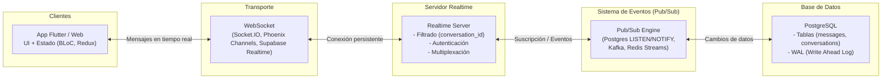

# Clase: Implementación de Chat en Tiempo Real (Clean Architecture + Supabase)

## Objetivo de la clase

Esta guía está pensada para el profesor. Indica exactamente qué decir, qué mostrar y en qué orden reconstruir el sistema de chat.

---

# FASE 0: Contexto inicial (5 minutos)

## Qué decir

"Hoy vamos a construir un chat en tiempo real. Pero no lo vamos a hacer desde cero... lo vamos a reconstruir."

"Además, no solo eliminé lógica en BLoCs y UseCases… también rompí el contrato del Repository."

"Vamos a reconstruir TODO el flujo de Clean Architecture desde dominio hacia data."

---

# FASE 1: Mostrar el estado roto (5 minutos)

## Qué mostrar

- ChatRepository incompleto
- ChatRepositoryImpl incompleto
- No hay métodos de chat
- No hay usecases
- BLoCs vacíos

## Qué decir

"En este momento la aplicación solo sabe traer usuarios."

"Pregunta: ¿qué piezas faltan para que exista un chat?"

Guiar a:
- conversaciones
- mensajes
- realtime

---

# FASE 2: Restaurar el contrato del dominio (20 minutos)

## Paso 1: Abrir ChatRepository

Mostrar que SOLO existe:

```dart
abstract class ChatRepository {
  Future<List<Profile>> getProfiles(String currentUserId);
}
```

## Qué decir

"El dominio define qué puede hacer el sistema. Si esto no está aquí, no existe en la aplicación."

---

## Paso 2: Agregar responsabilidades de chat

## Qué hacer (editar archivo)

Agregar:

```dart
Future<Conversation> getOrCreateConversation(
  String currentUserId,
  String otherUserId,
);

Future<void> sendMessage(Message message);

Stream<List<Message>> watchMessages(String conversationId);
```

## Qué decir

"Estoy definiendo capacidades del sistema, no implementación."

---

## Paso 3: Importar modelos

```dart
import 'package:appmovil261/features/chat/domain/models/conversation.dart';
import 'package:appmovil261/features/chat/domain/models/message.dart';
```

---

# FASE 3: Implementar RepositoryImpl (15 minutos)

## Paso 1: Mostrar implementación rota

Mostrar que ChatRepositoryImpl solo tiene getProfiles.

## Qué decir

"El contrato dice que puedo enviar mensajes… pero la implementación no lo soporta. Esto rompe la arquitectura."

---

## Paso 2: Reagregar métodos

```dart
@override
Future<Conversation> getOrCreateConversation(
  String currentUserId,
  String otherUserId,
) {
  return _dataSource.getOrCreateConversation(currentUserId, otherUserId);
}

@override
Future<void> sendMessage(Message message) {
  return _dataSource.sendMessage(message);
}

@override
Stream<List<Message>> watchMessages(String conversationId) {
  return _dataSource.watchMessages(conversationId);
}
```

---

## Qué decir

"El repository no piensa. Solo delega."

---

# FASE 4: Crear UseCases (20 minutos)

## Qué decir

"Ahora sí podemos crear casos de uso. Antes no tenía sentido porque el dominio estaba incompleto."

---

## Crear archivos

Crear:

- get_or_create_conversation_usecase.dart
- send_message_usecase.dart
- watch_messages_usecase.dart

---

## Código

```dart
class GetOrCreateConversationUsecase {
  final ChatRepository _repository = ChatRepositoryImpl();

  Future<Conversation> execute(String currentUserId, String otherUserId) {
    return _repository.getOrCreateConversation(currentUserId, otherUserId);
  }
}
```

```dart
class SendMessageUsecase {
  final ChatRepository _repository = ChatRepositoryImpl();

  Future<void> execute(Message message) {
    return _repository.sendMessage(message);
  }
}
```

```dart
class WatchMessagesUsecase {
  final ChatRepository _repository = ChatRepositoryImpl();

  Stream<List<Message>> execute(String conversationId) {
    return _repository.watchMessages(conversationId);
  }
}
```

---

# FASE 5: UsersBloc (15 minutos)

## Qué decir

"Ahora que el dominio existe, el BLoC puede usarlo."

---

## Implementar selección de usuario

```dart
final GetOrCreateConversationUsecase _conversationUsecase =
    GetOrCreateConversationUsecase();
```

```dart
on<SelectUserEvent>(_selectUser);
```

```dart
Future<void> _selectUser(
  SelectUserEvent event,
  Emitter<UsersState> emit,
) async {
  try {
    final conversation = await _conversationUsecase.execute(
      event.currentUserId,
      event.otherUser.id,
    );

    emit(NavigateToChatState(conversation.id, event.otherUser.name));
  } catch (e) {
    emit(UsersErrorState(e.toString()));
  }
}
```

---

# FASE 6: ChatBloc (25 minutos)

## Qué decir

"El chat es donde aparece la complejidad real: streams."

---

## Implementación

```dart
final _watchUsecase = WatchMessagesUsecase();
final _sendUsecase = SendMessageUsecase();
StreamSubscription<List<Message>>? _subscription;
```

```dart
on<SubscribeToMessagesEvent>(_subscribe);
on<_MessagesUpdatedEvent>(_onUpdated);
on<SendMessageEvent>(_send);
```

---

## Suscripción

```dart
void _subscribe(
  SubscribeToMessagesEvent event,
  Emitter<ChatState> emit,
) {
  emit(ChatLoadingState());
  _subscription?.cancel();

  _subscription = _watchUsecase.execute(event.conversationId).listen(
    (messages) => add(_MessagesUpdatedEvent(messages)),
    onError: (e) => add(_MessagesUpdatedEvent([])),
  );
}
```

---

## Actualización

```dart
void _onUpdated(
  _MessagesUpdatedEvent event,
  Emitter<ChatState> emit,
) {
  emit(ChatLoadedState(event.messages));
}
```

---

## Envío

```dart
Future<void> _send(
  SendMessageEvent event,
  Emitter<ChatState> emit,
) async {
  try {
    final msg = Message(
      id: '',
      conversationId: event.conversationId,
      senderId: event.senderId,
      content: event.content,
      createdAt: DateTime.now(),
    );

    await _sendUsecase.execute(msg);
  } catch (e) {
    emit(ChatErrorState(e.toString()));
  }
}
```

---

# FASE 7: Limpieza

```dart
@override
Future<void> close() {
  _subscription?.cancel();
  return super.close();
}
```

---

# Cierre

## Qué decir

"El orden correcto de construcción NO es UI primero."

"El orden correcto es:
1. Dominio (contratos)
2. Data (implementación)
3. UseCases
4. BLoC
5. UI"




