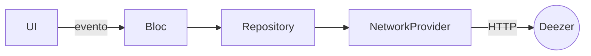

# Laboratorio 4: Deezer ain't the best option

<!-- tags: http.get, jsonDecode, Track.fromJson, Repository, NetworkProvider, BlocProvider, SearchBloc, 'String' is not a subtype of 'int', FormatException, Firebase Realtime Database POST -->

Todos en nuestro día a día usamos aplicaciones de música como YouTube, Spotify y Apple Music. Pero nunca hemos oído que alguien recomiende `Deezer` como plataforma.
No obstante, posee una API abierta (las demás exigen autenticación) que permite interactuar con la plataforma. Esto es una buena característica para el curso de aplicaciones móviles ya que podemos usar data actualizada, no un mock. A Deezer nadie lo usa, todos lo programan.

El laboratorio consiste en hacer una pantalla de búsqueda de música. Cuando encontremos la canción que nos guste, vamos a agregarla a mis `me gusta`. Posteriormente, podré consultar mis me gusta.

Vamos a hacerlo usando 2 pantallas: `SearchMusicScreen` y `LikedSongsScreen`.

Necesitas conocer `Bloc` (eventos, estados y `BlocProvider`), `Future`/`async` y cómo consumir un endpoint con `http`.

## Arquitectura del laboratorio

Cada capa tiene una sola responsabilidad y solo conoce a la de su derecha:



## Endpoint

El endpoint de Deezer para buscar es

```plain
https://api.deezer.com/search?q=bohemian%20rhapsody
```

Si corre la app en web, esa URL no trae los headers de CORS. Use en su lugar `https://i2thub.icesi.edu.co:5443/deezer/search?q=bohemian%20rhapsody`.

Sólo vamos a usar los datos de id, título, artista y albumCover.
De modo que vamos a usar este modelo de datos

## Modelo de datos

```dart
class Track {
  final int id;
  final String title;
  final String artist;
  final String albumCover;

  Track({
    required this.id,
    required this.title,
    required this.artist,
    required this.albumCover,
  });
}
```

Y no menos importante, debemos crear un factory para poder hacer deserializaciones

```dart
factory Track.fromJson(Map<String, dynamic> json) {
    return Track(
      ?,
      title: json['title'],
      artist: json['artist']['name'],
      ?,
    );
}
```

Donde `?` es para que usted analice el JSON y luego de analizar, sepa qué debe poner allí.

## NetworkProvider

Ya teniendo el modelo, vamos a crear entonces el `NetworkProvider`, la única clase que sabe que existe HTTP.

```dart
import 'dart:convert';
import 'package:http/http.dart' as http;

class DeezerNetworkProvider {
  final String _baseUrl = "https://api.deezer.com";

  /// Busca canciones en Deezer por nombre, artista, etc.
  Future<List<Track>> searchTracks(String query) async {
    final url = Uri.parse("$_baseUrl/search?q=${Uri.encodeComponent(query)}");

    final response = await http.get(url);

    if (response.statusCode == 200) {
      final data = jsonDecode(response.body);

      final List results = data['data'];
      return results.map((json) => Track.fromJson(json)).toList();
    } else {
      throw Exception("Error al buscar canciones: ${response.statusCode}");
    }
  }
}
```

Para esto necesitas agregar `http: ^1.5.0` a tu `pubspec.yaml`. `Uri.encodeComponent` evita que espacios o símbolos como `&` rompan la búsqueda.

## Capa de Repository

En proyectos que aún están jóvenes o pequeños puede llegar a pensar "¿todo esto sí es necesario?" y aunque parezca que inicialmente el repositorio no tiene sentido y sólo es un bypass hacia BloC, recuerde que este punto es vital porque desde esta capa decidimos si hacemos uso de una fuente externa o de una base de datos local.

Desde este punto, podemos hacer transformaciones para emitir sólo la información necesaria al resto de la aplicación, podemos filtrar, mezclar, transformar y demás de acuerdo a las features que dispongamos.

```dart
/// Repository: abstrae los providers y expone una API limpia al Bloc
class DeezerRepository {
  final DeezerNetworkProvider _networkProvider;

  DeezerRepository(this._networkProvider);

  /// Busca canciones y devuelve una lista de modelos Track
  Future<List<Track>> searchSongs(String query) async {
    try {
      final tracks = await _networkProvider.searchTracks(query);

      // Aquí podríamos aplicar transformaciones, filtrado,
      // cacheo en base de datos local, etc.
      return tracks;
    } catch (e) {
      throw Exception("Error en Repository al buscar canciones: $e");
    }
  }
}
```

## BloC

Recuerde que el BloC recibe eventos de la UI y emite estados. Para emitir esos estados, el BloC debe consultar a fuentes de información por medio de Repository.

Debemos usar la librería de flutter_bloc. Así que use `flutter_bloc: ^9.1.1` en su `pubspec.yaml`

Pero vamos en orden, primero hay que definir los eventos. Debemos usar estratégicamente la herencia.

```dart
/// Eventos que el Bloc puede recibir
abstract class SearchEvent {}

/// Cuando el usuario busca canciones con un query
class SearchSongsEvent extends SearchEvent {
  final String query;

  SearchSongsEvent(this.query);
}
```

Vamos ahora a definir los estados

```dart
/// Estados posibles del Bloc
abstract class SearchState {}

/// Estado inicial
class SearchInitial extends SearchState {}

/// Estado mientras se buscan canciones
class SearchLoading extends SearchState {}

/// Estado cuando hay resultados
class SearchSuccess extends SearchState {
  final List<Track> tracks;

  SearchSuccess(this.tracks);
}

/// Estado cuando ocurre un error
class SearchFailure extends SearchState {
  final String message;

  SearchFailure(this.message);
}
```

Finalmente el BloC. Recibe el `Repository` por constructor y arranca en el estado inicial

```dart
class SearchBloc extends Bloc<SearchEvent, SearchState> {
  final DeezerRepository repository;

  SearchBloc(this.repository) : super(SearchInitial()) {
    on<SearchSongsEvent>(_onSearchSongs);
  }
}
```

El método `on()` registra el evento, y el manejador emite la respuesta.

```dart
Future<void> _onSearchSongs(
        SearchSongsEvent event,
        Emitter<SearchState> emit,
    ) async {
    emit(SearchLoading());
    try {
      final results = await repository.searchSongs(event.query);
      if (results.isEmpty) {
        emit(SearchFailure("No se encontraron canciones"));
      } else {
        emit(SearchSuccess(results));
      }
    } catch (e) {
      emit(SearchFailure("Error al buscar canciones: $e"));
    }
}
```

## Capa UI

Finalmente vamos con la capa de UI. Luego de todo este periplo por capas, finalmente aterrizamos todo a un árbol de componentes.

```dart
BlocBuilder<SearchBloc, SearchState>(
  builder: (context, state) {
    if (state is SearchInitial) {
      return const Text("Escribe algo para buscar");
    } else if (state is SearchLoading) {
      return const CircularProgressIndicator();
    } else if (state is SearchSuccess) {
      return ListView.builder(
        itemCount: state.tracks.length,
        itemBuilder: (context, index) {
          final track = state.tracks[index];
          return ListTile(
            title: Text(track.title),
            subtitle: Text(track.artist),
            leading: Image.network(track.albumCover),
          );
        },
      );
    } else if (state is SearchFailure) {
      return Text("Error: ${state.message}");
    } else {
      return const SizedBox.shrink();
    }
  },
)
```

Este trozo de pantalla deberá ir dentro de un `BlocProvider`, que es donde se ensambla la cadena de capas de derecha a izquierda:

```dart
BlocProvider(
  create: (_) => SearchBloc(DeezerRepository(DeezerNetworkProvider())),
  child: const SearchMusicView(),
)
```

Genere lo necesario para que quede OK: un `TextField` que despache `SearchSongsEvent(query)` y este `BlocBuilder` debajo.

## Haciendo POST

Use este endpoint para hacer POST de sus canciones. Cambie `miusername` por su usuario

```plain
https://facelogprueba.firebaseio.com/playlist/miusername.json
```

Cada POST agrega un hijo nuevo bajo `miusername` con una llave generada por Firebase. Para hacer post puede usar este bloque de código de guía

```dart
final String _likesUrl = "https://facelogprueba.firebaseio.com/playlist/miusername.json";

Future<void> postTrack(Track track) async {
    final url = Uri.parse(_likesUrl);

    final response = await http.post(
      url,
      headers: {
        "Content-Type": "application/json",
      },
      body: jsonEncode({
        "id": track.id,
        "title": track.title,
        "artist": track.artist,
        "albumCover": track.albumCover,
      }),
    );
    print(response.statusCode);
}
```

## Consultando mis me gusta

Si en lugar de hacer POST hace GET a la misma URL, puede comprobar con su navegador o con Postman si efectivamente se guardan las canciones o no. La respuesta es un `Map` cuyas llaves son las generadas por Firebase (no una lista), o `null` si aún no hay canciones:

```plain
{
  "-OaBc123": { "id": 3135556, "title": "Not Afraid", "artist": "Eminem", "albumCover": "https://..." },
  "-OaBc124": { "id": 3135557, "title": "Lose Yourself", "artist": "Eminem", "albumCover": "https://..." }
}
```

Lo que guardó es plano: `artist` es un `String`, no el objeto anidado de Deezer. Por eso `Track.fromJson` fallaría con `type 'String' is not a subtype of type 'int' of 'index'`. Necesita un segundo factory para leer lo guardado, y recorrer solo los valores del `Map`:

```dart
factory Track.fromLikedJson(Map<String, dynamic> json) {
    return Track(
      id: json['id'],
      title: json['title'],
      artist: json['artist'],
      albumCover: json['albumCover'],
    );
}
```

```dart
final data = jsonDecode(response.body) as Map<String, dynamic>?;
final tracks = (data ?? {}).values.map((json) => Track.fromLikedJson(json)).toList();
```

## Criterios de entrega

- `SearchMusicScreen` busca canciones y las muestra con su carátula, título y artista, con estados de carga y de error.
- Cada canción tiene un botón de `me gusta` que la guarda con POST.
- `LikedSongsScreen` consulta con GET y muestra sus canciones guardadas.
- Las capas están separadas: la UI habla con el `Bloc`, el `Bloc` con el `Repository` y el `Repository` con el `NetworkProvider`.

.
