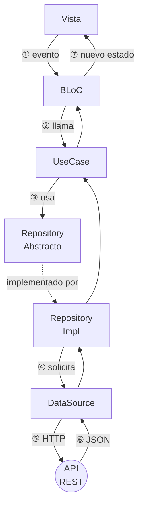

# Clean Architecture con BLoC

<!-- tags: Clean Architecture, UseCase, Repository abstracto, RepositoryImpl, DataSource, inversión de dependencias, capa de dominio, BlocProvider, inyección por constructor, quién crea las dependencias -->

En este módulo implementamos Clean Architecture combinada con BLoC para construir apps Flutter robustas y fáciles de mantener. La regla fundamental del patrón: las capas externas dependen de las internas, nunca al revés. El dominio no sabe nada del mundo exterior.

Parte de `Bloc` (eventos y estados) y de una arquitectura por capas típica: `UI → Bloc → Repository → NetworkProvider`. Aquí esa cadena se refina en dos pasos: el `Repository` se parte en un contrato abstracto y su implementación, y aparece el `UseCase` entre el `Bloc` y el repositorio. El `NetworkProvider` pasa a llamarse `DataSource`.

## Las tres capas

```svg
<svg xmlns="http://www.w3.org/2000/svg" width="520" height="520" font-family="Roboto, Arial, sans-serif" style="display:block;margin:0 auto;">
  <defs>
    <marker id="dep" markerWidth="8" markerHeight="8" refX="6" refY="3" orient="auto">
      <path d="M0,0 L0,6 L8,3 z" fill="#555"/>
    </marker>
  </defs>

  <!-- Outer ring: Infraestructura -->
  <circle cx="260" cy="265" r="238" fill="#FFA726" fill-opacity="0.08" stroke="#FFA726" stroke-width="2"/>

  <!-- Middle ring: Aplicación -->
  <circle cx="260" cy="265" r="152" fill="#42A5F5" fill-opacity="0.09" stroke="#42A5F5" stroke-width="2"/>

  <!-- Inner circle: Dominio -->
  <circle cx="260" cy="265" r="70" fill="#66BB6A" fill-opacity="0.18" stroke="#66BB6A" stroke-width="2.5"/>

  <!-- === DOMINIO (inner) === -->
  <text x="260" y="219" text-anchor="middle" fill="#66BB6A" font-size="10" font-weight="bold" letter-spacing="1">DOMINIO · PURO</text>
  <text x="260" y="252" text-anchor="middle" fill="#66BB6A" font-size="15" font-weight="bold">UseCase</text>
  <text x="260" y="273" text-anchor="middle" fill="#66BB6A" font-size="12">Repository</text>
  <text x="260" y="291" text-anchor="middle" fill="#66BB6A" font-size="12">Abstracto</text>

  <!-- === APLICACIÓN (middle ring) === -->
  <text x="260" y="138" text-anchor="middle" fill="#42A5F5" font-size="10" font-weight="bold" letter-spacing="1">APLICACIÓN</text>
  <text x="260" y="168" text-anchor="middle" fill="#42A5F5" font-size="19" font-weight="bold">BLoC</text>

  <!-- === INFRAESTRUCTURA (outer ring) === -->
  <!-- Layer label at top -->
  <text x="260" y="42" text-anchor="middle" fill="#FFA726" font-size="10" font-weight="bold" letter-spacing="1">INFRAESTRUCTURA</text>

  <!-- Vista / Widget at top -->
  <text x="260" y="78" text-anchor="middle" fill="#FFA726" font-size="15" font-weight="bold">Vista / Widget</text>

  <!-- RepositoryImpl at bottom-left (r≈195, angle=225° visual) -->
  <!-- x = 260 + 195·sin(225°) ≈ 260 − 138 = 122 -->
  <!-- y = 265 − 195·cos(225°) ≈ 265 + 138 = 403 -->
  <text x="108" y="398" text-anchor="middle" fill="#FFA726" font-size="14" font-weight="bold">Repository</text>
  <text x="108" y="416" text-anchor="middle" fill="#FFA726" font-size="13">Impl</text>

  <!-- DataSource at bottom-right (r≈195, angle=135° visual) -->
  <!-- x = 260 + 195·sin(135°) ≈ 260 + 138 = 398 -->
  <!-- y = 265 − 195·cos(135°) ≈ 265 + 138 = 403 -->
  <text x="412" y="398" text-anchor="middle" fill="#FFA726" font-size="14" font-weight="bold">Data</text>
  <text x="412" y="416" text-anchor="middle" fill="#FFA726" font-size="13">Source</text>

  <!-- Dependency arrows (pointing inward = toward center) -->
  <!-- Vista → BLoC -->
  <line x1="260" y1="88" x2="260" y2="148" stroke="#555" stroke-width="1.5" stroke-dasharray="5,3" marker-end="url(#dep)"/>
  <!-- BLoC → Domain top -->
  <line x1="260" y1="178" x2="260" y2="192" stroke="#555" stroke-width="1.5" stroke-dasharray="5,3" marker-end="url(#dep)"/>
  <!-- RepoImpl → Domain (lower-left edge of inner circle) -->
  <!-- inner circle edge at 225°: x=260−70·sin(45°)≈211, y=265+70·cos(45°)≈314 -->
  <line x1="172" y1="400" x2="218" y2="317" stroke="#555" stroke-width="1.5" stroke-dasharray="5,3" marker-end="url(#dep)"/>
  <!-- DataSource → RepoImpl (just showing connection within outer ring) -->
  <line x1="348" y1="400" x2="302" y2="317" stroke="#555" stroke-width="1.5" stroke-dasharray="5,3" marker-end="url(#dep)"/>

  <!-- Bottom note -->
  <text x="260" y="510" text-anchor="middle" fill="#555" font-size="11">Las dependencias apuntan hacia el centro</text>
</svg>
```

Las capas se leen de adentro hacia afuera. Cuanto más al centro, más pura y estable es la capa.

- Dominio (núcleo) — No depende de nadie. Solo Dart puro. Aquí viven `UseCase` y `RepositoryAbstracto`.
- Aplicación — Contiene `BLoC`. Solo conoce el Dominio.
- Infraestructura (exterior) — Contiene `Vista`, `RepositoryImpl` y `DataSource`. Es la capa que toca el mundo real: HTTP, bases de datos, Flutter UI.

En carpetas esto se ve como `domain/`, `data/` (`RepositoryImpl` y `DataSource`) y `ui/` (`BLoC` y `Vista`). El anillo exterior del gráfico agrupa `data/` y la Vista porque ambas tocan el mundo real.

## Flujo de una petición

Cuando el usuario realiza una acción, los datos viajan así:



El BLoC nunca llama directamente a `RepositoryImpl`. Solo conoce la abstracción. Eso es la inversión de dependencias.

## Dominio: el núcleo puro

Es el corazón de la aplicación. No importa nada de Flutter, HTTP ni librerías externas. Si el dominio compila con `dart run`, estás en buen camino.

## Entidad

El objeto de negocio que viaja por todas las capas. Es Dart puro.

```dart
class Track {
  final int id;
  final String title;
  final String artistName;
  final String albumCover;
  final String previewUrl;

  Track({
    required this.id,
    required this.title,
    required this.artistName,
    required this.albumCover,
    required this.previewUrl,
  });

  factory Track.fromJson(Map<String, dynamic> json) {
    return Track(
      id: json['id'] as int,
      title: json['title'] as String,
      artistName: (json['artist'] as Map<String, dynamic>)['name'] as String,
      albumCover: (json['album'] as Map<String, dynamic>)['cover_medium'] as String,
      previewUrl: json['preview'] as String,
    );
  }
}
```

## RepositoryAbstracto

Define el contrato que el dominio necesita. No sabe cómo se obtienen los datos, solo qué datos necesita.

```dart
abstract class MusicRepository {
  Future<List<Track>> searchTracks(String query);
}
```

- Es una clase abstracta: solo declara métodos, no los implementa.
- El `UseCase` depende de esta abstracción, nunca de `RepositoryImpl`.
- Permite cambiar la fuente de datos (HTTP, mock, SQLite) sin tocar una sola línea del dominio.

## UseCase

Encapsula una acción de negocio concreta. Un `UseCase` = una responsabilidad. Recibe el repositorio por constructor.

```dart
class SearchTracksUseCase {
  final MusicRepository repository;

  SearchTracksUseCase(this.repository);

  Future<List<Track>> call(String query) {
    return repository.searchTracks(query);
  }
}
```

- El método `call` permite usar la sintaxis `await useCase(query)` directamente.
- Solo importa entidades y contratos del dominio. Cero dependencias a HTTP, BLoC o Flutter.
- Si necesitas probar la lógica de negocio, solo mockeas `MusicRepository`: no hay más dependencias.

## Datos: la capa que toca el mundo exterior

Aquí se implementan los contratos del dominio y se conecta con APIs, bases de datos o cualquier fuente externa.

## DataSource

Hace la llamada HTTP y convierte el JSON en entidades. Es la única clase que sabe que existe HTTP.

```dart
abstract class MusicDataSource {
  Future<List<Track>> fetchTracks(String query);
}

class MusicDataSourceImpl implements MusicDataSource {
  @override
  Future<List<Track>> fetchTracks(String query) async {
    final uri = Uri.parse('https://api.deezer.com/search?q=${Uri.encodeComponent(query)}');
    final response = await http.get(uri);

    if (response.statusCode != 200) {
      throw Exception('Error ${response.statusCode}');
    }

    final body = jsonDecode(response.body) as Map<String, dynamic>;
    final list = body['data'] as List;
    return list.map((e) => Track.fromJson(e as Map<String, dynamic>)).toList();
  }
}
```

## RepositoryImpl

Implementa `RepositoryAbstracto` y recibe el `DataSource` por constructor. Es el puente entre dominio y datos.

```dart
class MusicRepositoryImpl implements MusicRepository {
  final MusicDataSource dataSource;

  MusicRepositoryImpl(this.dataSource);

  @override
  Future<List<Track>> searchTracks(String query) {
    return dataSource.fetchTracks(query);
  }
}
```

- `implements MusicRepository`: aquí ocurre la conexión entre dominio e infraestructura.
- Es el lugar para decidir de dónde salen los datos: puede orquestar varios `DataSource` (red + caché) sin que el dominio lo sepa.

## Presentación: BLoC y Vista

## BLoC

Recibe eventos de la UI, invoca el `UseCase` y emite estados. No sabe nada de HTTP ni de cómo se obtienen los datos.

```dart
abstract class SearchEvent {}

class SubmitSearchEvent extends SearchEvent {
  final String query;
  SubmitSearchEvent(this.query);
}

abstract class SearchState {
  final List<Track> tracks;
  SearchState({this.tracks = const []});
}

class SearchIdleState extends SearchState {}

class SearchLoadingState extends SearchState {}

class SearchLoadedState extends SearchState {
  SearchLoadedState({required super.tracks});
}

class SearchErrorState extends SearchState {
  final String message;
  SearchErrorState(this.message);
}

class SearchBloc extends Bloc<SearchEvent, SearchState> {
  final SearchTracksUseCase searchTracks;

  SearchBloc(this.searchTracks) : super(SearchIdleState()) {
    on<SubmitSearchEvent>((event, emit) async {
      emit(SearchLoadingState());
      try {
        final tracks = await searchTracks(event.query);
        emit(SearchLoadedState(tracks: tracks));
      } on Exception catch (e) {
        emit(SearchErrorState(e.toString()));
      }
    });
  }
}
```

## Vista / Widget

Escucha los estados del BLoC y renderiza la UI. No contiene lógica de negocio.

```dart
BlocBuilder<SearchBloc, SearchState>(
  builder: (context, state) {
    if (state is SearchLoadingState) return const CircularProgressIndicator();
    if (state is SearchErrorState) return Text(state.message);
    return ListView(
      children: state.tracks.map((t) => ListTile(title: Text(t.title))).toList(),
    );
  },
)
```

## Ensamblaje

Ninguna capa crea a la capa de la que depende: alguien de afuera las construye y se las pasa. Ese ensamblaje ocurre en un solo lugar, el `BlocProvider`, de la capa más externa a la más interna:

```dart
BlocProvider(
  create: (_) => SearchBloc(
    SearchTracksUseCase(
      MusicRepositoryImpl(
        MusicDataSourceImpl(),
      ),
    ),
  ),
  child: const SearchScreen(),
)
```

Es la única línea que conoce a la vez `MusicRepositoryImpl` y `MusicDataSourceImpl`. Cambiar la fuente de datos es cambiar esa línea.

## Resumen: quién conoce a quién

```svg
<svg xmlns="http://www.w3.org/2000/svg" width="580" height="210" font-family="Roboto, Arial, sans-serif" font-size="13" style="display:block;margin:0 auto;">
  <defs>
    <marker id="arr" markerWidth="8" markerHeight="8" refX="6" refY="3" orient="auto">
      <path d="M0,0 L0,6 L8,3 z" fill="#777"/>
    </marker>
    <marker id="arr-dash" markerWidth="8" markerHeight="8" refX="6" refY="3" orient="auto">
      <path d="M0,0 L0,6 L8,3 z" fill="#66BB6A"/>
    </marker>
  </defs>

  <!-- Vista -->
  <rect x="10" y="75" width="80" height="52" rx="8" fill="#FFA726"/>
  <text x="50" y="98" text-anchor="middle" fill="white" font-weight="bold" font-size="12">Vista</text>
  <text x="50" y="116" text-anchor="middle" fill="white" font-size="10">Widget</text>
  <line x1="90" y1="101" x2="110" y2="101" stroke="#777" stroke-width="2" marker-end="url(#arr)"/>

  <!-- BLoC -->
  <rect x="110" y="75" width="80" height="52" rx="8" fill="#42A5F5"/>
  <text x="150" y="105" text-anchor="middle" fill="white" font-weight="bold" font-size="12">BLoC</text>
  <line x1="190" y1="101" x2="210" y2="101" stroke="#777" stroke-width="2" marker-end="url(#arr)"/>

  <!-- Domain box -->
  <rect x="205" y="55" width="200" height="95" rx="10" fill="none" stroke="#66BB6A" stroke-width="2" stroke-dasharray="6,3"/>
  <text x="305" y="48" text-anchor="middle" fill="#66BB6A" font-size="10" font-weight="bold">DOMINIO · PURO</text>

  <!-- UseCase -->
  <rect x="215" y="72" width="80" height="52" rx="8" fill="#66BB6A"/>
  <text x="255" y="96" text-anchor="middle" fill="white" font-weight="bold" font-size="12">UseCase</text>
  <text x="255" y="113" text-anchor="middle" fill="white" font-size="10">call(query)</text>
  <line x1="295" y1="101" x2="315" y2="101" stroke="#777" stroke-width="2" marker-end="url(#arr)"/>

  <!-- RepositoryAbstracto -->
  <rect x="315" y="72" width="80" height="52" rx="8" fill="#66BB6A"/>
  <text x="355" y="93" text-anchor="middle" fill="white" font-weight="bold" font-size="11">Repository</text>
  <text x="355" y="108" text-anchor="middle" fill="white" font-size="11">Abstracto</text>
  <text x="355" y="122" text-anchor="middle" fill="white" font-size="9">interface</text>

  <!-- dashed arrow to impl -->
  <line x1="395" y1="101" x2="415" y2="101" stroke="#66BB6A" stroke-width="2" stroke-dasharray="5,3" marker-end="url(#arr-dash)"/>

  <!-- RepositoryImpl -->
  <rect x="415" y="75" width="80" height="52" rx="8" fill="#FFA726"/>
  <text x="455" y="97" text-anchor="middle" fill="white" font-weight="bold" font-size="11">Repository</text>
  <text x="455" y="113" text-anchor="middle" fill="white" font-size="11">Impl</text>
  <line x1="495" y1="101" x2="515" y2="101" stroke="#777" stroke-width="2" marker-end="url(#arr)"/>

  <!-- DataSource -->
  <rect x="515" y="75" width="55" height="52" rx="8" fill="#FFA726"/>
  <text x="542" y="97" text-anchor="middle" fill="white" font-weight="bold" font-size="11">Data</text>
  <text x="542" y="113" text-anchor="middle" fill="white" font-size="11">Source</text>

  <!-- Legend -->
  <rect x="10" y="170" width="12" height="12" rx="2" fill="#66BB6A"/>
  <text x="28" y="181" fill="#aaa" font-size="11">Dominio puro (sin Flutter, sin HTTP)</text>
  <rect x="240" y="170" width="12" height="12" rx="2" fill="#42A5F5"/>
  <text x="258" y="181" fill="#aaa" font-size="11">Aplicación (BLoC)</text>
  <rect x="370" y="170" width="12" height="12" rx="2" fill="#FFA726"/>
  <text x="388" y="181" fill="#aaa" font-size="11">Infraestructura</text>

  <!-- dashed line legend -->
  <line x1="10" y1="198" x2="35" y2="198" stroke="#66BB6A" stroke-width="2" stroke-dasharray="5,3"/>
  <text x="42" y="202" fill="#aaa" font-size="11">implementa (Impl cumple el contrato abstracto)</text>
</svg>
```

- `Vista` solo habla con `BLoC` — nada más.
- `BLoC` solo habla con `UseCase`, jamás con `RepositoryImpl`.
- `UseCase` solo conoce `RepositoryAbstracto` — no sabe si los datos vienen de HTTP o de una base de datos.
- `RepositoryImpl` cumple el contrato del dominio e invoca `DataSource`.
- La flecha punteada verde indica implementación: `RepositoryImpl` satisface la interfaz que el dominio define.
