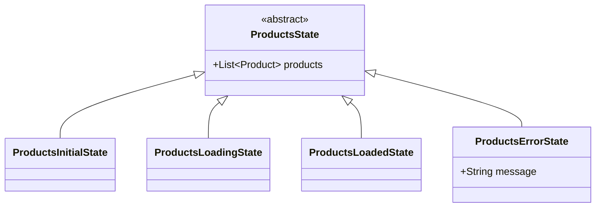

# State Management Strategies

<!-- tags: estado base, la lista desaparece al recargar, super.products, state.products, The getter 'products' isn't defined, estados disjuntos, clase padre del estado, ProductsState, Cannot add to an unmodifiable list, qué va en la clase padre -->

Un `Bloc` decide qué estados existen, y cada estado decide qué datos viajan con él. Esa segunda decisión es la que define cómo se comporta la pantalla mientras carga o cuando algo falla. En esta lección comparamos dos estrategias sobre un mismo ejemplo, el catálogo de una tienda, y solo miramos la capa de `Bloc`: estados, eventos y el `Bloc` mismo. La vista y el acceso a datos no cambian de una estrategia a otra.

Si vienes de *Clean Architecture con BLoC*, ya usaste esta idea sin que tuviera nombre: `SearchState` guardaba `tracks` en la clase padre. Aquí se explica por qué.

## El ejemplo: catálogo de una tienda

La pantalla lista los productos de una tienda. Cada `Product` tiene `id`, `name`, `price` y `category`, y la lista llega de un `GetProductsUseCase`, igual que `SearchTracksUseCase` en la lección anterior. De dónde salen los datos no importa aquí.

La pantalla pasa por cuatro momentos: arranca sin nada, carga, muestra la lista y a veces falla. Además tiene un botón de recargar. La pregunta que separa las dos estrategias es esta: **si el usuario ya ve cinco productos y toca recargar, ¿qué ve mientras llega la respuesta? ¿Y si la recarga falla?**

```svg
<svg xmlns="http://www.w3.org/2000/svg" width="720" height="430" viewBox="0 0 720 430" font-family="Roboto, Arial, sans-serif" style="display:block;margin:0 auto;max-width:100%;height:auto;">
  <defs>
    <clipPath id="sms-cell"><rect x="0" y="0" width="160" height="150" rx="10"/></clipPath>
    <marker id="sms-arrow" markerWidth="8" markerHeight="8" refX="6" refY="3" orient="auto"><path d="M0,0 L0,6 L8,3 z" fill="#888"/></marker>
    <g id="sms-bar">
      <rect x="0" y="0" width="160" height="150" fill="#FFFFFF"/>
      <rect x="0" y="0" width="160" height="24" fill="#1976D2"/>
      <text x="10" y="16" fill="#FFFFFF" font-size="10" font-weight="bold">Productos</text>
    </g>
    <g id="sms-list" font-size="10" fill="#212121">
      <rect x="10" y="36" width="18" height="18" rx="4" fill="#EF5350"/>
      <text x="36" y="49">Manzana roja</text>
      <rect x="10" y="64" width="18" height="18" rx="4" fill="#FFA726"/>
      <text x="36" y="77">Jugo de naranja</text>
      <rect x="10" y="92" width="18" height="18" rx="4" fill="#90CAF9"/>
      <text x="36" y="105">Leche entera</text>
      <rect x="10" y="120" width="18" height="18" rx="4" fill="#4FC3F7"/>
      <text x="36" y="133">Agua con gas</text>
    </g>
  </defs>

  <text x="250" y="22" text-anchor="middle" fill="#888" font-size="10">con la lista cargada</text>
  <text x="430" y="22" text-anchor="middle" fill="#888" font-size="10">el usuario recarga</text>
  <text x="610" y="22" text-anchor="middle" fill="#888" font-size="10">la recarga falla</text>
  <text x="250" y="40" text-anchor="middle" fill="#42A5F5" font-size="11" font-weight="bold" font-family="monospace">ProductsLoadedState</text>
  <text x="430" y="40" text-anchor="middle" fill="#42A5F5" font-size="11" font-weight="bold" font-family="monospace">ProductsLoadingState</text>
  <text x="610" y="40" text-anchor="middle" fill="#42A5F5" font-size="11" font-weight="bold" font-family="monospace">ProductsErrorState</text>

  <text x="12" y="122" fill="#888" font-size="13" font-weight="bold">Estrategia 1</text>
  <text x="12" y="140" fill="#888" font-size="10">Cada estado con</text>
  <text x="12" y="154" fill="#888" font-size="10">sus propios datos</text>
  <text x="12" y="312" fill="#888" font-size="13" font-weight="bold">Estrategia 2</text>
  <text x="12" y="330" fill="#888" font-size="10">Estado base en</text>
  <text x="12" y="344" fill="#888" font-size="10">la clase padre</text>

  <g transform="translate(170,60)">
    <g clip-path="url(#sms-cell)">
      <use href="#sms-bar"/>
      <use href="#sms-list"/>
    </g>
    <rect x="0" y="0" width="160" height="150" rx="10" fill="none" stroke="#9E9E9E"/>
  </g>
  <g transform="translate(350,60)">
    <g clip-path="url(#sms-cell)">
      <use href="#sms-bar"/>
      <circle cx="80" cy="87" r="13" fill="none" stroke="#1976D2" stroke-width="3" stroke-dasharray="56 26" stroke-linecap="round"/>
    </g>
    <rect x="0" y="0" width="160" height="150" rx="10" fill="none" stroke="#9E9E9E"/>
  </g>
  <g transform="translate(530,60)">
    <g clip-path="url(#sms-cell)">
      <use href="#sms-bar"/>
      <circle cx="80" cy="74" r="11" fill="#EF5350"/>
      <text x="80" y="79" text-anchor="middle" fill="#FFFFFF" font-size="14" font-weight="bold">!</text>
      <text x="80" y="106" text-anchor="middle" fill="#C62828" font-size="10">Error de conexión</text>
    </g>
    <rect x="0" y="0" width="160" height="150" rx="10" fill="none" stroke="#9E9E9E"/>
  </g>

  <g transform="translate(170,250)">
    <g clip-path="url(#sms-cell)">
      <use href="#sms-bar"/>
      <use href="#sms-list"/>
    </g>
    <rect x="0" y="0" width="160" height="150" rx="10" fill="none" stroke="#9E9E9E"/>
  </g>
  <g transform="translate(350,250)">
    <g clip-path="url(#sms-cell)">
      <use href="#sms-bar"/>
      <rect x="0" y="24" width="160" height="3" fill="#BBDEFB"/>
      <rect x="0" y="24" width="60" height="3" fill="#1976D2"/>
      <use href="#sms-list"/>
    </g>
    <rect x="0" y="0" width="160" height="150" rx="10" fill="none" stroke="#9E9E9E"/>
  </g>
  <g transform="translate(530,250)">
    <g clip-path="url(#sms-cell)">
      <use href="#sms-bar"/>
      <use href="#sms-list"/>
      <rect x="8" y="114" width="144" height="28" rx="4" fill="#323232"/>
      <text x="18" y="132" fill="#FFFFFF" font-size="10">Error de conexión</text>
    </g>
    <rect x="0" y="0" width="160" height="150" rx="10" fill="none" stroke="#9E9E9E"/>
  </g>

  <line x1="332" y1="135" x2="345" y2="135" stroke="#888" stroke-width="1.5" marker-end="url(#sms-arrow)"/>
  <line x1="512" y1="135" x2="525" y2="135" stroke="#888" stroke-width="1.5" marker-end="url(#sms-arrow)"/>
  <line x1="332" y1="325" x2="345" y2="325" stroke="#888" stroke-width="1.5" marker-end="url(#sms-arrow)"/>
  <line x1="512" y1="325" x2="525" y2="325" stroke="#888" stroke-width="1.5" marker-end="url(#sms-arrow)"/>

  <text x="430" y="228" text-anchor="middle" fill="#EF5350" font-size="11">✗ la lista desaparece</text>
  <text x="610" y="228" text-anchor="middle" fill="#EF5350" font-size="11">✗ se pierde la lista</text>
  <text x="430" y="418" text-anchor="middle" fill="#66BB6A" font-size="11">✓ la lista sigue visible</text>
  <text x="610" y="418" text-anchor="middle" fill="#66BB6A" font-size="11">✓ el error va sobre la lista</text>
</svg>
```

Los tres momentos son los mismos en las dos filas y los emite el mismo `Bloc`. Lo único que cambia es qué datos lleva cada estado.

## Estrategia 1 · Cada estado con sus propios datos

Es la forma más directa: cada subclase declara solo lo que ella necesita. La lista vive únicamente en `ProductsLoadedState` y el mensaje en `ProductsErrorState`.

```dart
abstract class ProductsState {}

class ProductsInitialState extends ProductsState {}

class ProductsLoadingState extends ProductsState {}

class ProductsLoadedState extends ProductsState {
  final List<Product> products;

  ProductsLoadedState(this.products);
}

class ProductsErrorState extends ProductsState {
  final String message;

  ProductsErrorState(this.message);
}
```

El problema aparece en cuanto la pantalla ya tiene algo que mostrar:

- Al recargar, el `Bloc` emite `ProductsLoadingState`, que no trae productos. La vista no tiene qué dibujar y la lista desaparece hasta que llega la respuesta.
- Si la recarga falla, `ProductsErrorState` solo trae el mensaje. El usuario pierde una lista que ya tenía por culpa de un error de red.
- Dentro del `Bloc`, recuperar la lista actual obliga a preguntar el tipo y a castear:

```dart
final current = state is ProductsLoadedState
    ? (state as ProductsLoadedState).products
    : <Product>[];
```

El `as` no sobra. `state` es un *getter* de `Bloc`, y Dart no promueve el tipo de un getter después de un `is`: escribir `if (state is ProductsLoadedState) state.products` no compila y da `The getter 'products' isn't defined for the type 'ProductsState'`.

Esta estrategia no está mal. Sirve cuando cada estado reemplaza la pantalla entera, como un buscador donde cada búsqueda nueva descarta los resultados anteriores. Deja de servir cuando la pantalla tiene algo que debe sobrevivir entre un estado y otro.

## Estrategia 2 · El estado base vive en la clase padre

Llamamos **estado base** a lo que la pantalla muestra sin importar el momento en que esté. En el catálogo, es la lista de productos. Ese dato se declara una sola vez, en la clase padre, y toda subclase lo hereda.

```dart
abstract class ProductsState {
  final List<Product> products;

  ProductsState({required this.products});
}

class ProductsInitialState extends ProductsState {
  ProductsInitialState() : super(products: const []);
}

class ProductsLoadingState extends ProductsState {
  ProductsLoadingState({required super.products});
}

class ProductsLoadedState extends ProductsState {
  ProductsLoadedState({required super.products});
}

class ProductsErrorState extends ProductsState {
  final String message;

  ProductsErrorState(this.message, {required super.products});
}
```



- `products` está en `ProductsState`, así que un `ProductsLoadingState` o un `ProductsErrorState` también saben qué productos hay.
- `required super.products` le pasa el valor directo al constructor del padre. Es la forma corta de `ProductsLoadingState({required List<Product> products}) : super(products: products);`.
- Solo `ProductsInitialState` fija la lista, vacía: es el único momento en que de verdad no hay productos.
- `message` se queda en `ProductsErrorState`, porque solo tiene sentido cuando algo falló.

El `required` en cada subclase es deliberado. Obliga a quien emite un estado a decidir qué lista lleva. Si la clase padre tuviera un valor por defecto (`this.products = const []`), olvidar pasarla compilaría sin quejarse y la lista se vaciaría en silencio.

## El Bloc

Un solo evento sirve para la primera carga y para recargar:

```dart
abstract class ProductsEvent {}

class LoadProductsEvent extends ProductsEvent {}

class ProductsBloc extends Bloc<ProductsEvent, ProductsState> {
  final GetProductsUseCase _getProducts;

  ProductsBloc(this._getProducts) : super(ProductsInitialState()) {
    on<LoadProductsEvent>(_onLoadProducts);
  }

  Future<void> _onLoadProducts(
    LoadProductsEvent event,
    Emitter<ProductsState> emit,
  ) async {
    emit(ProductsLoadingState(products: state.products));
    try {
      final products = await _getProducts();
      emit(ProductsLoadedState(products: products));
    } on Exception catch (e) {
      emit(ProductsErrorState(e.toString(), products: state.products));
    }
  }
}
```

`state.products` funciona sin preguntar el tipo ni castear: sea cual sea el estado actual, la lista está declarada en la clase padre. Cada `emit` es una decisión explícita sobre la lista:

| `emit` | Lista que lleva | Por qué |
|---|---|---|
| `ProductsLoadingState` | `state.products` | Mientras carga se sigue viendo lo que ya había |
| `ProductsLoadedState` | `products` | La respuesta nueva reemplaza a la anterior |
| `ProductsErrorState` | `state.products` | Un fallo no borra lo que el usuario ya tenía |

En el `catch`, `state` ya es el `ProductsLoadingState` emitido dos líneas antes, que traía la lista. Por eso la lista sobrevive a los dos saltos: de cargado a cargando y de cargando a error.

## Qué va en la clase padre

El criterio es una pregunta: **¿la pantalla lo sigue mostrando mientras carga o después de un error?** Si la respuesta es sí, va en la clase padre. Si solo tiene sentido en un momento concreto, va en la subclase de ese momento.

| Dato | Dónde | Por qué |
|---|---|---|
| Lista de productos | `ProductsState` | Se dibuja en todos los momentos |
| Categoría elegida en un filtro | `ProductsState` | El filtro sigue marcado mientras carga |
| Mensaje de error | `ProductsErrorState` | Solo existe cuando algo falló |

No conviene subir todo a la clase padre. Si `message` viviera ahí, cada estado tendría que decidir qué hacer con él, y un error viejo podría reaparecer dentro de un `ProductsLoadedState`.

## Errores típicos

**La lista desaparece al recargar.** Algún `emit` crea un estado con una lista que no es la actual, por ejemplo `ProductsLoadingState(products: const [])`. Revisa que cada `emit` que no trae datos nuevos pase `state.products`.

**`The getter 'products' isn't defined for the type 'ProductsState'`.** Declaraste `products` en una subclase y lo lees desde `state`, que es de tipo `ProductsState`. Súbelo a la clase padre.

**`Unsupported operation: Cannot add to an unmodifiable list`.** Modificaste la lista del estado en lugar de crear una nueva. `const []` no se puede modificar, y aunque la lista sí se pudiera, estarías cambiando también la del estado anterior:

```dart
state.products.add(event.product);
emit(ProductsLoadedState(products: state.products));
```

La forma correcta es emitir una lista nueva que copie la actual y agregue el producto:

```dart
emit(ProductsLoadedState(products: [...state.products, event.product]));
```

## Resumen

| | Estrategia 1 · Estados disjuntos | Estrategia 2 · Estado base en el padre |
|---|---|---|
| Al recargar | La lista desaparece | La lista sigue visible |
| Si falla | Solo queda el error | El error se muestra sobre la lista |
| Leer la lista en el `Bloc` | `is` + `as` | `state.products` |
| Cuándo usarla | Cada estado reemplaza la pantalla entera | La pantalla tiene datos que deben sobrevivir entre estados |
