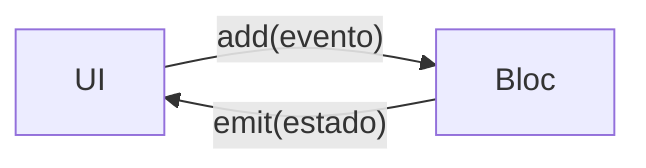

# Introducción a Bloc

<!-- tags: Bloc, BlocProvider, BlocBuilder, método on, emit, context.read, add(evento), Cubit vs Bloc, context that does not contain a Bloc -->

`Cubit` maneja el estado con funciones que la UI llama directamente. `Bloc` ofrece más potencia y trazabilidad al costo de un poco más de código (verboso, sí. Pero poderoso).

Esta lección asume que ya sabes qué es un `Cubit`, y usa `BlocProvider`, `BlocBuilder` y `context.read` igual que allí.

## ¿Qué es un Bloc?

Un `Bloc` (Business Logic Component) maneja un estado y lo expone a la UI, igual que un `Cubit`. La diferencia fundamental está en cómo se piden los cambios de estado:

- `Cubit`: expones funciones públicas que la UI llama directamente para emitir nuevos estados. Es directo y simple.
- `Bloc`: en lugar de funciones, la UI despacha `eventos`. El `Bloc` los recibe, ejecuta la lógica correspondiente y emite nuevos estados.

Cada interacción posible es un evento. Eso hace explícito qué puede ocurrir en la pantalla y facilita el seguimiento, el registro de logs y las pruebas.



## Dependencia

```yaml
dependencies:
  flutter_bloc: ^9.1.1
```

## Componentes de un Bloc

Un `Bloc` se compone de tres partes: eventos, estados y el propio Bloc.

## 1. Eventos (Events)

Son las entradas del `Bloc`. Representan una acción del usuario o un suceso del sistema que requiere un cambio de estado. Se definen como clases.

```dart
abstract class CounterEvent {}

class CounterIncrementPressed extends CounterEvent {}

class CounterDecrementPressed extends CounterEvent {}
```

## 2. Estados (States)

Son la salida del `Bloc`, igual que en `Cubit`: una foto de lo que la UI debe mostrar.

```dart
class CounterState {
  final int count;
  const CounterState(this.count);
}
```

## 3. El Bloc

Aquí reside la lógica. Escucha los eventos entrantes y los transforma en estados salientes.

```dart
import 'package:flutter_bloc/flutter_bloc.dart';

class CounterBloc extends Bloc<CounterEvent, CounterState> {
  CounterBloc() : super(const CounterState(0)) {
    on<CounterIncrementPressed>((event, emit) {
      emit(CounterState(state.count + 1));
    });

    on<CounterDecrementPressed>((event, emit) {
      if (state.count > 0) {
        emit(CounterState(state.count - 1));
      }
    });
  }
}
```

- `CounterBloc` extiende `Bloc<CounterEvent, CounterState>`.
- El constructor define el estado inicial.
- `on<EventType>` registra un manejador para un tipo de evento. Dentro de él se emiten estados con `emit()`.
- Un mismo `Bloc` puede registrar tantos `on<...>` como eventos tenga.

## Usar el Bloc en la UI

La integración es casi idéntica a la de `Cubit`. Cambia una sola cosa: en lugar de llamar una función, se añade un evento.

`BlocProvider` provee la instancia del `Bloc` al árbol de widgets.

```dart
class CounterScreen extends StatelessWidget {
  const CounterScreen({super.key});

  @override
  Widget build(BuildContext context) {
    return BlocProvider(
      create: (_) => CounterBloc(),
      child: Scaffold(
        appBar: AppBar(title: const Text('Contador con Bloc')),
        body: const CounterView(),
      ),
    );
  }
}
```

Para despachar un evento se lee el `Bloc` del contexto y se usa `add`:

```dart
FloatingActionButton(
  onPressed: () => context.read<CounterBloc>().add(CounterIncrementPressed()),
  child: const Icon(Icons.add),
)
```

El `Bloc` recibe el evento, lo enruta al `on` registrado para ese tipo y este emite un nuevo estado:

```dart
on<CounterIncrementPressed>((event, emit) {
  emit(CounterState(state.count + 1));
});
```

La vista lo recibe con `BlocBuilder`, que reconstruye su `builder` cada vez que llega un estado nuevo:

```dart
BlocBuilder<CounterBloc, CounterState>(
  builder: (context, state) {
    return Text('${state.count}');
  },
)
```

La diferencia práctica con `Cubit`:

```dart
context.read<MyCubit>().myFunction();
context.read<MyBloc>().add(MyEvent());
```

## Ejemplo completo

Un solo `main.dart` para probarlo:

```dart
import 'package:flutter/material.dart';
import 'package:flutter_bloc/flutter_bloc.dart';

abstract class CounterEvent {}

class CounterIncrementPressed extends CounterEvent {}

class CounterDecrementPressed extends CounterEvent {}

class CounterState {
  final int count;
  const CounterState(this.count);
}

class CounterBloc extends Bloc<CounterEvent, CounterState> {
  CounterBloc() : super(const CounterState(0)) {
    on<CounterIncrementPressed>((event, emit) {
      emit(CounterState(state.count + 1));
    });
    on<CounterDecrementPressed>((event, emit) {
      if (state.count > 0) {
        emit(CounterState(state.count - 1));
      }
    });
  }
}

void main() {
  runApp(MaterialApp(routes: {'/': (_) => const CounterScreen()}));
}

class CounterScreen extends StatelessWidget {
  const CounterScreen({super.key});

  @override
  Widget build(BuildContext context) {
    return BlocProvider(
      create: (_) => CounterBloc(),
      child: Scaffold(
        appBar: AppBar(title: const Text('Contador con Bloc')),
        body: const CounterView(),
      ),
    );
  }
}

class CounterView extends StatelessWidget {
  const CounterView({super.key});

  @override
  Widget build(BuildContext context) {
    return Center(
      child: Column(
        mainAxisAlignment: MainAxisAlignment.center,
        children: [
          BlocBuilder<CounterBloc, CounterState>(
            builder: (context, state) {
              return Text('${state.count}', style: const TextStyle(fontSize: 48));
            },
          ),
          Row(
            mainAxisAlignment: MainAxisAlignment.center,
            children: [
              IconButton(
                onPressed: () => context.read<CounterBloc>().add(CounterDecrementPressed()),
                icon: const Icon(Icons.remove),
              ),
              IconButton(
                onPressed: () => context.read<CounterBloc>().add(CounterIncrementPressed()),
                icon: const Icon(Icons.add),
              ),
            ],
          ),
        ],
      ),
    );
  }
}
```

`CounterView` va dentro del `BlocProvider`, no en el mismo `build` que lo crea: si `context.read<CounterBloc>()` se llama con un `context` que está por encima del provider, Flutter lanza `BlocProvider.of() called with a context that does not contain a Bloc`.

## ¿Cuándo usar Bloc en lugar de Cubit?

- `Cubit` para lógica de estado simple. Es más rápido de escribir y más fácil de entender.
- `Bloc` cuando hay lógica compleja, con múltiples eventos posibles y necesitas trazabilidad de los cambios de estado. Es ideal para flujos paso a paso o máquinas de estado.
